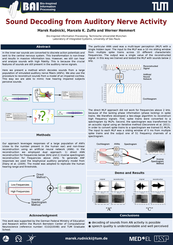

inverse_cochlea
===============

*inverse_cochlea* can reconstruct sounds from the activity of auditory
nerve fibers' using artificial neural networks::

  __|______|______|____    +-----------+
  _|________|______|___ -->|  Inverse  |      .-.     .-.     .-.
  ___|______|____|_____ -->|           |-->  /   \   /   \   /   \
  __|______|______|____ -->|  Cochlea  |          '-'     '-'
                           +-----------+
        ANF activity                                 Sound

Bernstein Conference 2012
-------------------------

Rudnicki M, Zuffo MK and Hemmert W (2012). Sound Decoding from
Auditory Nerve Activity. Front. Comput. Neurosci. Conference Abstract:
Bernstein Conference 2012. doi: 10.3389/conf.fncom.2012.55.00092

`Full abstract`_

Poster
......

.. _`Full abstract`: https://www.frontiersin.org/10.3389/conf.fncom.2012.55.00092/event_abstract

Usage
-----

The direct reconstruction with an artificial neural network (suitable
for frequencies to up 2 kHz) is implemented in
inverse_cochlea.MlpReconstructor.  The reconstruction using a
combination of an artificial neural network and inverse spectrogram is
implemented in inverse_cochlea.ISgramReconstructor.

Both reconstructor classes can be configured by the constructor
parameters and have train() and run() methods.

To see how to use the package, have a look at the scripts in the
examples_ directory.

.. _examples: ./examples

Requirements
------------

- Python 2.7
- Numpy
- Scipy
- Pandas
- joblib
- cochlea_

For the  MlpReconstructor:

- ffnet

For the ISgramReconstructor:

- oct2py or pytave
- GNU Octave with ltfat_ preinstalled

.. _cochlea: https://github.com/mrkrd/cochlea
.. _ltfat: https://ltfat.github.io/

License
-------

The project is licensed under the GNU General Public License v3 or
later (GPLv3+).
